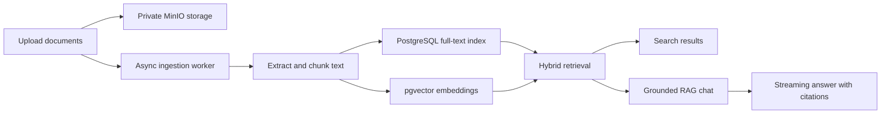

# Knowledge Hub

Knowledge Hub is a self-hosted document intelligence application that turns a
private document library into searchable, source-backed knowledge.

Authenticated users can upload PDF, DOCX, text, and Markdown files, organize
them into collections, search by exact wording or semantic meaning, and ask
questions through a Retrieval-Augmented Generation (RAG) chat. Answers are
grounded in the user's documents, include inspectable citations, and report when
the available evidence is insufficient.

The project is designed for personal use and small teams where each account has
an isolated knowledge base. It is not a general-purpose chatbot or an enterprise
multi-tenant SaaS platform.

## What It Does

- Provides registration, login, token refresh, password reset, session control,
  and account deletion.
- Stores original files privately in MinIO and exposes them only through
  authorized, short-lived download links.
- Extracts and chunks documents asynchronously with Apache Tika, then stores
  searchable text and vector embeddings in PostgreSQL with pgvector.
- Detects duplicate uploads and supports explicit duplicate confirmation.
- Organizes documents into collections and tracks pending, processing, ready,
  and failed ingestion states.
- Combines PostgreSQL full-text search with vector similarity for hybrid search.
- Streams RAG chat responses over Server-Sent Events (SSE), saves conversation
  history, and attaches citations to the source chunks used.
- Restricts documents, collections, searches, and chats to their authenticated
  owner.
- Includes deterministic fake AI clients so local development and CI work
  without a paid provider or API key.

## How It Works



Uploads create durable records before an in-process worker extracts content,
creates overlapping chunks, and generates embeddings. Search and chat retrieve
only ready chunks owned by the current user and within the selected collection
or document scope. Chat treats retrieved text as untrusted evidence rather than
instructions and refuses to invent an answer when retrieval is too weak.

## Project Status

The initial product scope is implemented. All 13 vertical slices in the
[implementation ledger](docs/implementation-ledger.md) are verified, including
authentication, document ingestion, hybrid search, cited RAG chat, the React
workspace, observability, CI, and the critical Playwright flow.

Features intentionally outside the current scope include shared team
workspaces, RBAC, billing, external document connectors, OCR, audit logs, and
general-knowledge chat fallback.

## Technology

| Area      | Stack                                                               |
| --------- | ------------------------------------------------------------------- |
| Backend   | Java 25, Spring Boot 4, Spring AI, Spring Security, Spring Data JPA |
| Data      | PostgreSQL 16, pgvector, Flyway                                     |
| Documents | MinIO, Apache Tika                                                  |
| Frontend  | React 19, TypeScript, Vite, Tailwind CSS, TanStack Query, Zustand   |
| Testing   | JUnit, Testcontainers, Vitest, React Testing Library, Playwright    |
| Delivery  | Docker Compose, GitHub Actions                                      |

## Repository Layout

```text
Knowledge-hub/
|-- knowledge-hub-api/   Spring Boot API, ingestion worker, retrieval, and RAG
|-- knowledge-hub-web/   React web application and Playwright tests
|-- docs/                Product requirements, design spec, and implementation ledger
|-- compose.yaml         Local PostgreSQL/pgvector and MinIO services
|-- compose.e2e.yaml     Isolated infrastructure for end-to-end tests
`-- .env.example         Local and production configuration reference
```

## Run Locally

### Prerequisites

- Java 25
- Node.js 24 and npm
- Docker Desktop or another Docker Engine with Compose

### 1. Configure the Environment

The committed defaults run safely in deterministic fake-AI mode. Create a local
`.env` file if you want to keep or override them:

```powershell
Copy-Item .env.example .env
```

On macOS or Linux, use `cp .env.example .env` instead. The `.env` file is
gitignored and must not be committed.

### 2. Start PostgreSQL and MinIO

From the repository root:

```shell
docker compose up -d
docker compose ps
```

PostgreSQL listens on `localhost:5433`. MinIO listens on `localhost:9000`, with
its development console at `http://localhost:9001`.

### 3. Start the API

Open another terminal:

```powershell
cd knowledge-hub-api
.\mvnw.cmd spring-boot:run
```

On macOS or Linux, run `./mvnw spring-boot:run`. The API starts at
`http://localhost:8080`. Spring Boot can also start the root Compose services
automatically when they are not already running.

### 4. Start the Web Application

Open another terminal:

```shell
cd knowledge-hub-web
npm ci
npm run dev
```

Open `http://localhost:5173`, create an account, and upload a supported document.
Ingestion runs asynchronously, so a new document briefly moves through pending
and processing states before it becomes searchable.

### Local Endpoints

| Service         | URL                                             |
| --------------- | ----------------------------------------------- |
| Web application | http://localhost:5173                           |
| API             | http://localhost:8080                           |
| Swagger UI      | http://localhost:8080/swagger-ui.html           |
| OpenAPI JSON    | http://localhost:8080/v3/api-docs               |
| Liveness probe  | http://localhost:8080/actuator/health/liveness  |
| Readiness probe | http://localhost:8080/actuator/health/readiness |
| MinIO console   | http://localhost:9001                           |

## AI Modes

Fake AI mode is enabled by default through `AI_FAKE_MODE=true`. It creates
deterministic embeddings and cited responses without making external calls,
which is useful for development, demonstrations, and automated tests.

To use the configured OpenRouter or another OpenAI-compatible provider, set the
following values in `.env` and restart the API:

```dotenv
AI_FAKE_MODE=false
AI_PROVIDER_API_KEY=your-provider-key
AI_MODEL_CHAT=openai
AI_MODEL_EMBEDDING=openai
```

`AI_CHAT_MODEL`, `AI_EMBEDDING_MODEL`, and `AI_PROVIDER_BASE_URL` select the
models and endpoint. In real AI mode, extracted document content and retrieved
passages are sent to that external provider; review its privacy and retention
terms before using sensitive documents.

## Verification

Backend verification uses Testcontainers and requires Docker:

```powershell
cd knowledge-hub-api
.\mvnw.cmd clean verify
```

Frontend quality gates:

```shell
cd knowledge-hub-web
npm ci
npm run lint
npm run typecheck
npm run format:check
npm test
npm run build
```

The critical Playwright flow registers a user, uploads and ingests a document,
searches it, receives a cited chat response, and deletes the document. It uses
isolated service and application ports and removes its containers afterward:

```shell
cd knowledge-hub-web
npm run e2e:install
npm run e2e
```

GitHub Actions runs the backend, frontend, and end-to-end gates for pull
requests and pushes to `main`.

## Production Notes

The `prod` Spring profile disables automatic Docker Compose startup and public
OpenAPI documentation. It also rejects unsafe development configuration,
including fake AI, development credentials, insecure cookies, local service
URLs, missing SMTP/provider settings, and database connections without
`sslmode=verify-full`.

This repository provides application-level production safeguards, not a full
deployment topology. A real deployment should use TLS, a secret manager,
restricted MinIO application credentials, managed backups, explicit CORS and
registration policies, and separately operated frontend, API, PostgreSQL, and
MinIO services. See [.env.example](.env.example) for the complete configuration
surface.

## Design Documentation

- [Product Requirements Document](docs/prd-knowledge-hub-platform.md)
- [Software Design Document](docs/sdd-knowledge-hub-platform.md)
- [Implementation Ledger](docs/implementation-ledger.md)
